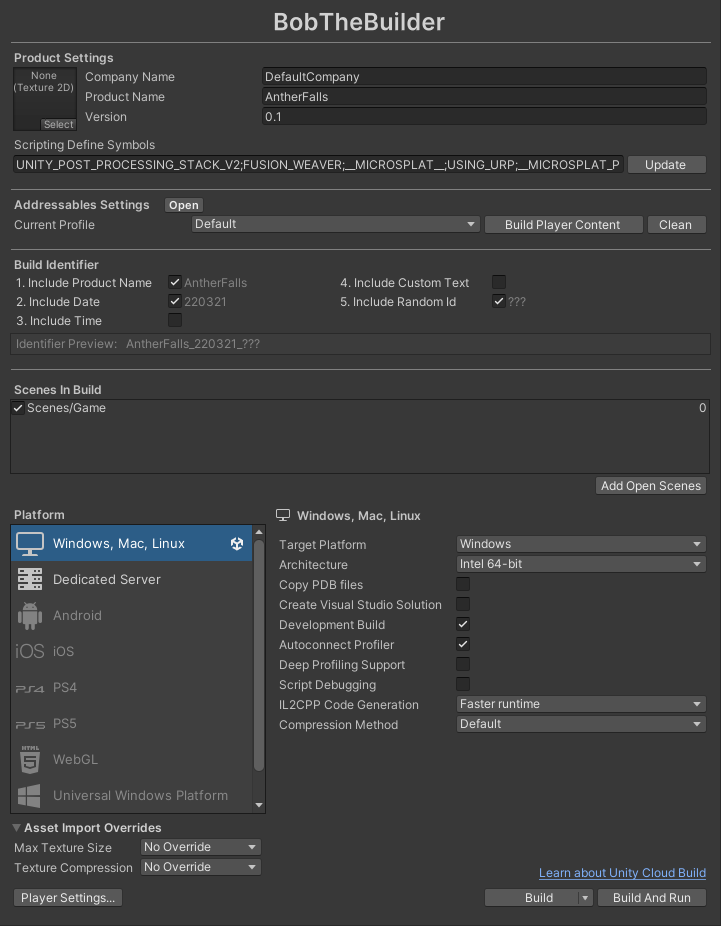

# BobTheBuilder_2018

Bob The Builder is a handy build tool that pulls all build-related windows into one along with a few extra features.

<h2>Section 1:</h2> Product Settings as available in the Player Settings. These fields define the general properties of the app including app name, app icon, and scripting defines.

<h2>Section 2:</h2> Addressables quick builder. Easily build/clean asset bundles and get access to a quick button to open the Addressables window itself.

<h2>Section 3:</h2> Build Identifier. Define the build's name with a wide variety of parameters including app name, date and time of build, custom text, and random id. Date and time is displayed in such a way that when build are ordered alphabetically, it also gets ordered by time it was built.

<h2>Section 4:</h2> The project build window that we all know and love.

  

<h1>Notes to Self:</h1>
- The build identifier is a little wonky because 2018 me couldn't figure out how to properly persist it between the project folder name and the reference to it in build. Just save it out to a text file adjacent to the project, dummy.  
- This is the standalone window version of BobTheBuilder. The latest version of BobTheBuilder is the exact same window but built directly into the Savant system. Maybe we can do a best of both worlds and support both?